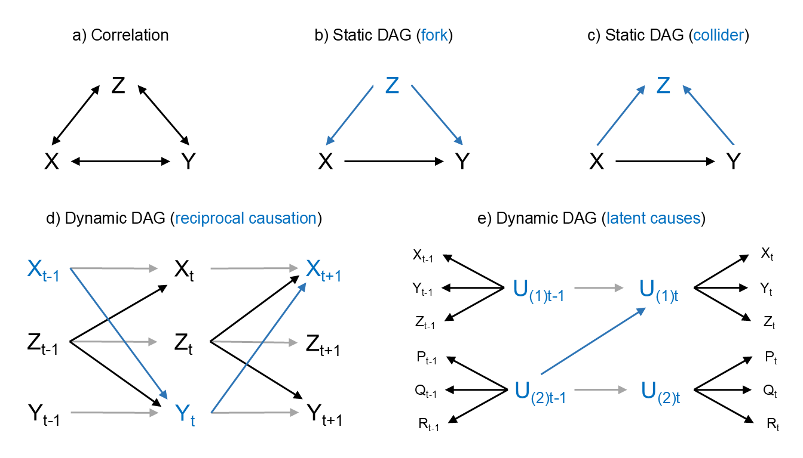

\begin{center}
Abstract text here...
\end{center}

# Introduction

Phylogenetic comparative methods (PCMs) are commonly used to study the
co-evolution of organismal traits, spanning topics such as anatomy and 
physiology [@Dunn2015; @Garland2005; @Navalon2019; @OConnor2022; @Thayer2018], 
life history and behavior [@Bielby2007; @Clayton1994; @MacLean2012; 
@Salguero2016], and cultural evolution [@Mace2005; @Navarrete2016; @Watts2016]. 
"Coevolution" in its broadest sense refers to repeatable patterns of trait 
covariation over time, which can be investigated using a diverse family of 
statistical techniques depending on the research question and type of data 
available [@Garamszegi2014; @Harvey1991; @Nunn2011]. Many PCMs focus on 
understanding how traits coevolve by estimating evolutionary correlations and 
rates of change across phylogenetic trees, which can be used to better 
understand natural history and inform ancestral state reconstructions. However,
evolutionary correlation does not imply evolutionary causation between traits 
[@Shipley2016]. Thus, PCMs facilitating inference of why traits coevolve and 
change together across time are indispensable tools for testing 
macroevolutionary and ecological theory.

Among others, phylogenetic generalized linear (mixed) models [@Grafen1989; 
@Hadfield2010; @Symonds2014], phylogenetic path analysis [@GonzalezVoyer2014; 
@vonHardenberg2013], and Pagel's [-@Pagel1994] discrete method are the most 
popular approaches for assessing trait coevolution on macroevolutionary 
timescales. While each of these methods has clear benefits and performs well 
under specific scenarios, they are each limited in their generality by strong 
assumptions regarding the direction of causal effects among traits, the process
of evolutionary change, and/or the statistical properties of the traits under 
investigation. As we detail further below, these modeling assumptions are likely
to be violated in most datasets used for phylogenetic analysis, increasing the 
risk of inferential error and ultimately inhibiting our ability to explain the
dynamics of phenotypic evolution. We therefore introduce a novel class of PCMs
designed to address these challenges in a cohesive and flexible statistical
framework, using Bayesian MCMC algorithms in the Stan statistical programming
language [@Carpenter2017].

We begin by briefly reviewing the benefits and constraints of current PCMs, 
particularly with regard to causal inference, exploring how their limitations 
motivate further methods development. We then formally and conceptually 
introduce a novel class of dynamic phylogenetic models. We provide a worked 
synthetic example of coevolution between two continuous traits -- illustrated as
female promiscuity and sperm length [@Fitzpatrick2009] -- to assess the accuracy
and uncertainty of inferences made with dynamic phylogenetic models across a 
reasonable range of sample sizes for phylogenetic research. We also provide an 
accompanying coding tutorial using our **coevolve** R package to aid empiricists
in easily applying basic dynamic phylogenetic models to their own datasets. We 
then demonstrate the generality and flexibility of our method with two empirical
applications, which extend the model to complex, high-dimensional scenarios 
using dynamic latent variables. In particular, we show how our method can 
generate insights into the causal dynamics of trait coevolution across both 
genetic and cultural evolutionary timescales, using (1) a comparative dataset on
primate brain size, sociality, diet, and life history traits [@DeCasien2017], 
which reduced to two coevolving latent variables, and (2) two studies on the 
evolution of social complexity across a global and a regional sample of 
pre-industrial human societies [@Ringen_preprint; @Sheehan2023].

# Current approaches and motivation for a novel method

Fundamental to PCMs is the adjustment of raw trait associations for shared 
evolutionary history using a phylogenetic tree (or set of trees) and a 
statistical model. In a basic sense, phylogenetic adjustment is crucial for 
facilitating causal inference, as shared evolutionary history tends to generate 
trait correlations among closely related species with similar phenotypes, 
creating the illusion of convergent co-evolution even when traits evolve 
independently. Adjustment for phylogeny reduces bias and variance due to 
clustering over the tree, thus reducing the risks of type I (false-positive), 
type II (false-negative), type M (magnitude), and type S (sign) errors during 
statistical inference (*CITE*). Nonetheless, adjustment for phylogeny is not a 
magic fix for all sources of unobserved confounding, nor does it guarantee that 
resulting estimates are causally interpretable (*CITE*). Therefore, while all 
PCMs employ statistical techniques that reduce bias, these methods vary widely 
in the degree to which they isolate the causal pathways by which traits coevolve 
over time, with most commonly used methods focusing largely on evolutionary 
correlation (\figref{fig:dags}a) rather than causation (\figref{fig:dags}b-e).

```{=latex}
\begin{figure}
```

```{r dags, echo=FALSE, out.width='100%'}

```

```{=latex}
\caption{Explanatory models of trait coevolution. \label{fig:dags}}
\textit{Note:} Examples of distinct formal approaches to describing and 
explaining patterns of coevolution among traits (bold letters), with important 
properties represented in each graph highlighted by blue arrows and text. 
Approaches range in complexity from (a) simple models of phylogenetic 
correlations (indicated by bidirectional arrows), which are useful for 
predictive purposes but fail to explain the causes of trait associations; to 
(b-e) directed acyclic graph models, which can be used to directly test the 
causal effects (directed arrows) driving trait associations across a phylogeny. 
As explained in Box 2 below, explicit causal models are crucial for deciding 
which traits should be included or excluded from a multivariate analysis to 
avoid potential biases due to phenomena such as so-called forks (b) and 
colliders (c). Causal models can also be further distinguished by whether they 
model relationships among traits as static (b-c) or dynamic (d-e) effects. Only 
dynamic models can be used to account for feedback processes 
(t\textsubscript{-1} → t → t\textsubscript{+1}) generated by reciprocal 
causation (blue arrows) among traits and autoregressive effects within traits 
(grey arrows) over time (d). For high dimensional problems, it is important to 
also consider whether inclusion of latent causes into the dynamic DAG (e), 
capturing dimensions of evolutionary integration among multiple traits, can 
provide a more parsimonious and theoretically insightful causal model (see 
\autoref{sec:empirical}).
\end{figure}
```

## Phylogenetic generalized linear (mixed) models

## Phylogenetic path analysis

## Pagel's discrete dynamic method

# Dynamic phylogenetic models

## Formal model

## Implementation

## Synthetic example

## Empirical applications

\label{sec:empirical}

### Brain size evolution in primates

### Evolution of social complexity across human societies

# Conclusion

# References
