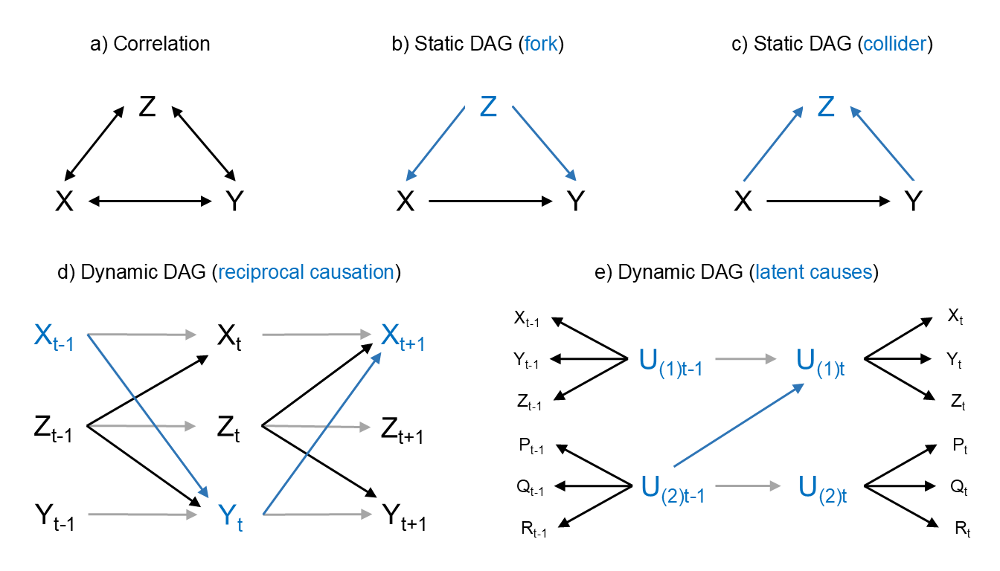
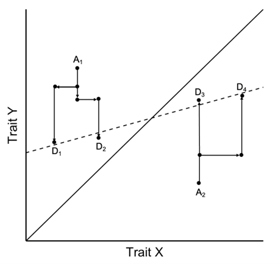
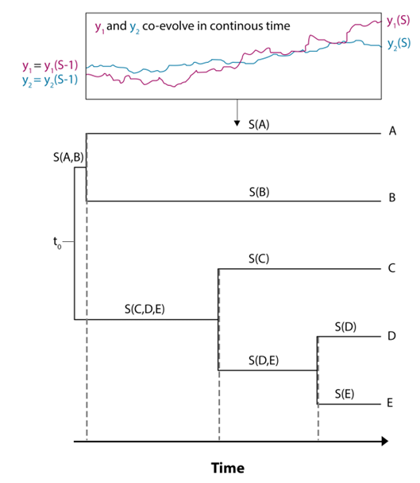

\begin{center}
\lipsum[1]
\end{center}

# Introduction

Phylogenetic comparative methods (PCMs) are commonly used to study the
coevolution of organismal traits, spanning topics such as anatomy and 
physiology [@Dunn2015; @Garland2005; @Navalon2019; @OConnor2022; @Thayer2018], 
life history and behavior [@Bielby2007; @Clayton1994; @MacLean2012; 
@Salguero2016], and cultural evolution [@Mace2005; @Navarrete2016; @Watts2016]. 
"Coevolution" in its broadest sense refers to repeatable patterns of trait 
covariation over time, which can be investigated using a diverse family of 
statistical techniques depending on the research question and type of data 
available [@Garamszegi2014; @Harvey1991; @Nunn2011]. Many PCMs focus on 
understanding how traits coevolve by estimating evolutionary correlations and 
rates of change across phylogenetic trees, which can be used to better 
understand natural history and inform ancestral state reconstructions. However,
evolutionary correlation does not imply evolutionary causation between traits 
[@Shipley2016]. Thus, PCMs facilitating inference of why traits coevolve and 
change together across time are indispensable tools for testing 
macroevolutionary and ecological theory.

Among others, phylogenetic generalized linear (mixed) models [@Grafen1989; 
@Hadfield2010; @Symonds2014], phylogenetic path analysis [@GonzalezVoyer2014; 
@vonHardenberg2013], and Pagel's [-@Pagel1994] discrete method are the most 
popular approaches for assessing trait coevolution on macroevolutionary 
timescales. While each of these methods has clear benefits and performs well 
under specific scenarios, they are each limited in their generality by strong 
assumptions regarding the direction of causal effects among traits, the process
of evolutionary change, and/or the statistical properties of the traits under 
investigation. As we detail further below, these modeling assumptions are likely
to be violated in most datasets used for phylogenetic analysis, increasing the 
risk of inferential error and ultimately inhibiting our ability to explain the
dynamics of phenotypic evolution. We therefore introduce a novel class of PCMs
designed to address these challenges in a cohesive and flexible statistical
framework, using Bayesian MCMC algorithms in the Stan statistical programming
language [@Carpenter2017].

We begin by briefly reviewing the benefits and constraints of current PCMs, 
particularly with regard to causal inference, exploring how their limitations 
motivate further methods development. We then formally and conceptually 
introduce a novel class of *dynamic phylogenetic models* (DPMs). We provide a 
worked synthetic example of coevolution between two continuous traits -- 
illustrated as female promiscuity and sperm length [@Fitzpatrick2009] -- to 
assess the accuracy and uncertainty of inferences made with dynamic phylogenetic
models across a reasonable range of sample sizes for phylogenetic research. We 
also provide an accompanying coding tutorial using our `coevolve` R package to
aid empiricists in easily applying basic dynamic phylogenetic models to their 
own datasets. We then demonstrate the generality and flexibility of our method 
with two empirical applications, which extend the model to complex, 
high-dimensional scenarios using dynamic latent variables. In particular, we 
show how our method can generate insights into the causal dynamics of trait 
coevolution across both genetic and cultural evolutionary timescales, using (1) 
a comparative dataset on primate brain size, sociality, diet, and life history 
traits [@DeCasien2017], which reduced to two coevolving latent variables, and 
(2) two studies on the evolution of social complexity across a global and a 
regional sample of pre-industrial human societies [@Ringen_preprint; 
@Sheehan2023].

# Current approaches and motivation for a novel method

Fundamental to PCMs is the adjustment of raw trait associations for shared 
evolutionary history using a phylogenetic tree (or set of trees) and a 
statistical model. In a basic sense, phylogenetic adjustment is crucial for 
facilitating causal inference, as shared evolutionary history tends to generate 
trait correlations among closely related species with similar phenotypes, 
creating the illusion of convergent coevolution even when traits evolve 
independently. Adjustment for phylogeny reduces bias and variance due to 
clustering over the tree, thus reducing the risks of type I (false-positive), 
type II (false-negative), type M (magnitude), and type S (sign) errors during 
statistical inference (*CITE*). Nonetheless, adjustment for phylogeny is not a 
magic fix for all sources of unobserved confounding, nor does it guarantee that 
resulting estimates are causally interpretable (*CITE*). Therefore, while all 
PCMs employ statistical techniques that reduce bias, these methods vary widely 
in the degree to which they isolate the causal pathways by which traits coevolve 
over time, with most commonly used methods focusing largely on evolutionary 
correlation (\autoref{fig:dags}a) rather than causation (\autoref{fig:dags}b-e).

```{r dags, echo=FALSE, fig.align='center', fig.cap="\\textit{Explanatory models of trait coevolution.} Examples of distinct formal approaches to describing and explaining patterns of coevolution among traits (bold letters), with important properties represented in each graph highlighted by blue arrows and text. Approaches range in complexity from (a) simple models of phylogenetic correlations (indicated by bidirectional arrows), which are useful for predictive purposes but fail to explain the causes of trait associations; to (b-e) directed acyclic graph models, which can be used to directly test the causal effects (directed arrows) driving trait associations across a phylogeny. Explicit causal models are crucial for deciding which traits should be included or excluded from a multivariate analysis to avoid potential biases due to phenomena such as so-called forks (b) and colliders (c). Causal models can also be further distinguished by whether they model relationships among traits as static (b-c) or dynamic (d-e) effects. Only dynamic models can be used to account for feedback processes (t\\textsubscript{-1} → t → t\\textsubscript{+1}) generated by reciprocal causation (blue arrows) among traits and autoregressive effects within traits (grey arrows) over time (d). For high dimensional problems, it is important to also consider whether inclusion of latent causes into the dynamic DAG (e), capturing dimensions of evolutionary integration among multiple traits, can provide a more parsimonious and theoretically insightful causal model (see \\autoref{sec:empirical}).", out.width='100%'}

```

## Phylogenetic generalized linear (mixed) models

Phylogenetic generalized linear (mixed) models are linear regression models used
to quantify trait covariance between species or populations due to shared 
evolutionary history (likewise for their predecessor, independent contrasts) 
[@Blomberg2012; @Grafen1989; @Hadfield2010; @Lynch1991; @Symonds2014]. The most 
commonly assumed model of trait coevolution in these regression models is 
Brownian motion (also called a Wiener process, *CITE*), which assumes that the 
trait variance for a given species or population is proportional to the total 
branch length of the tree leading from root to tip, and the covariance between 
any two species is proportional to their amount of shared history. This process
is often biologically interpreted as reflecting patterns of evolutionary drift 
(or neutral evolution) across a phylogenetic tree. Empirically, the actual 
degree of covariance between related species or populations may be less than
expected under a pure Brownian motion model, such as when evolution is rapid or,
more mundanely, when measurement error is substantial. In these cases, the 
"phylogenetic signal" will be weak such that even closely related taxa may have 
dramatically different trait values [@Blomberg2003; @Kamilar2013], motivating 
various branch length transformations to the basic model to account for this 
greater independence among taxa [@Pagel1999]. In cases where traits do not 
evolve according to a modified Brownian motion process, other adjustments can 
also be made to the basic phylogenetic generalized linear model to modify the 
expected rate change in trait (co)variation. For instance, early burst models 
of adaptive radiation allow the rate of change to decrease over time (*CITE*), 
while Ornstein-Uhlenbeck models characterize evolutionary change as the product
of both stochastic and deterministic processes (*CITE*).

Despite their differences, attempts to use parameters from any of these models
for causal inference share often unstated and undesirable assumptions, namely 
that there is no selection acting on the traits included as predictors, that all 
predictor traits are independent and direct causes of the response trait, and 
that there is no reciprocal causation between traits over time (see 
\autoref{fig:dags}). These are strong assumptions that are likely to be violated
in most empirical datasets, limiting the applicability of phylogenetic 
generalized linear (mixed) models for theory testing and development. In 
addition, the most commonly used implementation of these models, phylogenetic
generalized least squares regression, suffers from various other constraints 
such as being limited to traits with Gaussian errors, overfitting due to a lack
of parameter regularization, and a failure to accommodate many common data 
features such as repeated measures of species trait values, missing data, and 
measurement error. While multilevel/mixed-effects models can be used to address 
these statistical concerns [@Hadfield2010; @Ives2010; @Ives2011; @Lynch1991; 
@Martin2020; @Ringen2019], they nonetheless share the same basic limitations 
with regard to causal inference and are arguably not ideal for modelling 
adaptation [@Hansen2014] (Box \ref{box:evolutionary-regression-coefficients}).

\mybox[label=box:evolutionary-regression-coefficients]{Evolutionary regression coefficients underestimate causal effects}
An unintuitive aspect of traditional PCMs is that regression coefficients 
estimated using cross-sections of contemporary species are used to infer the 
change in some trait $Y$ in response to another trait $X$ over evolutionary 
time. The slope of a response trait on a predictor trait is known as the 
"evolutionary regression coefficient" [@Pagel1993]. For the evolutionary
regression coefficient to be interpreted as a causal effect, we must, as with 
all statistical models, assume that there are no unmeasured confounders and that
our parametric model is correct. But there is an additional caveat: because 
selection is (generally) a gradual process, the total causal effect of one trait
on another -- which we define as the change in the optimal trait value of $Y$ as
a function of the value of $X$ [see @Scholkopf2013 for a closely related 
definition of causal effects in systems of ordinary differential equations] -- 
can take a long time to be fully realized. As such, we capture species in the 
process of adaptation rather than at equilibrium. Consequently, traditional 
methods underestimate the total causal effect of one trait another. This 
attenuation bias is a joint product of the strength of selection on the response
trait and the rate of change in the predictor trait. Intuitively, if one trait 
changes too quickly, then the other will always be playing catch-up. See 
\autoref{fig:evo-reg-coef} for an illustration of this process. A solution to 
this problem is to move beyond traditional regression-based PCMs and explicitly
model trait change and the adaptive process using dynamic phylogenetic models.
\endmybox

```{r evo-reg-coef, echo=FALSE, fig.align='center', fig.cap='\\textit{Gradual adaptation flattens the evolutionary regression coefficient.} Ancestral species ("A") evolve towards their optimal trait Y value, which depends on the value of trait X shown on the solid line. Ancestors speciate and their descendants ("D") inherit their maladapted trait values, resulting in a slope between the two traits (dashed line) that is flatter than the true relationship. Redrawn from Figure 14.4 in Hansen (\\protect\\hyperlink{ref-Hansen2014}{2014}).', out.width='60%'}

```

## Phylogenetic path analysis

Fortunately, a major innovation in statistical research in recent decades has 
been to realize that even conventional regressions with observational data can 
be used to infer and test for the presence of causal relationships once 
appropriate assumptions are encoded into the model structure [@Shipley2016]. 
This is because specific causal models, usually represented as directed acyclic
graphs (DAGs, see \autoref{fig:dags}, Box 
\ref{box:evolutionary-regression-coefficients}), imply specific patterns of 
correlation (or covariance) among variables [@Pearl2009; @Rubin2005]. An 
elaborate toolbox now exists to determine the correct test of causal hypotheses
given a DAG. This has become the state-of-the-art in fields like epidemiology 
and is increasingly taught and used in evolutionary biology and ecology 
[@Deffner2022; @McElreath2020; @Shipley2016; @Warrell2020].

If one wants to test for a causal effect of $X$ (say diet) on $Y$ (say brain 
size), one has to carefully consider the relationship of potential third 
variables $Z$ (say sociality or life history), which, depending on the structure
of the DAG, should either be included in the regression analysis or not (see 
Figure 5). These considerations are what distinguish causal inference from 
standard predictive applications of multivariate regression. For instance, most 
researchers know that if $Z$ causes both $X$ and $Y$ (a "fork", 
\autoref{fig:dags}b), $Z$ should be included to remove spurious associations 
between $X$ and $Y$. However, if $Z$ is a collider (both $X$ and $Y$ cause $Z$; 
\autoref{fig:dags}c), $Z$ should not be included in the regression model, as 
doing so introduces a spurious association between $X$ and $Y$. For example, if
diet ($X$) and brain size ($Y$) independently caused longevity ($Z$) but were 
otherwise uncorrelated, conditioning on longevity would introduce a spurious 
negative association between diet and brain size. This further implies that the
appropriate set of covariates for testing a causal effect of $X$ on $Y$ may not
be the same as the set for testing the causal effect of $Z$ on $Y$. 
Nevertheless, all coefficients in a multivariate regression are commonly
interpreted as causal effects, a phenomenon known as the "table 2 fallacy" 
[@Westreich2013]. Most comparative analyses have not yet used the causal 
inference toolbox and typically include several variables in a phylogenetic 
generalized least squares model without formal causal justification. This 
implicitly assumes that all variables are independent causes, which is often 
problematic.

Phylogenetic path analysis represents a particular application of the causal 
inference toolbox that overcomes some of the issues outlined above for 
phylogenetic generalized least squares [@GonzalezVoyer2014; @vonHardenberg2013].
With phylogenetic path analysis, researchers pre-define specific causal models,
ideally avoiding colliders and other traps (\autoref{fig:dags}), and compare 
their fit to the data. Specifically, a DAG implies a set of variables that 
should be statistically independent, which is then tested using phylogenetic 
regression, such that several causal hypotheses can be compared. For instance, 
@Navarrete2016 presented several phylogenetic path analysis models that all 
included links between life history and social group size with brain size, with
variable direct or indirect effects of diet and technical intelligence. Thus, 
phylogenetic path analysis is well-suited for comparing existing hypotheses, 
with DAGs generated "top-down" from prior theory or empirical literature
[@GonzalezVoyer2014].

However, the applicability of phylogenetic path analysis is limited to static 
DAGs lacking any reciprocal effects over time, such as \autoref{fig:dags}b and c 
where $X$, $Y$, and $Z$ do not have any temporal structure that could be used
to resolve reciprocal causal effects. Such models assume a constant direction of
effect between two variables, with bidirectional causal effects only being able
to be described as unresolved patterns of correlation (\autoref{fig:dags}a). 
This is an issue because positive (or negative) evolutionary feedback loops are
predicted by many theoretical models in response to life history tradeoffs and 
various forms of frequency- and density-dependence, suggesting that reciprocal
causation is likely to be a common phenomenon explaining patterns of trait 
coevolution. For example, @McNamara2022 presents a model of the coevolution of
paternal care and extrapair paternity, which is driven by a frequency-dependent
feedback loop over evolutionary time between males' tendency to seek extrapair
copulations and the benefits of their paternal care. The inability to directly
test for such dynamic feedback effects is a fundamental limitation of 
phylogenetic path analysis and any other phylogenetic method reliant on static 
causal models, thus motivating the development of dynamic methods.

## Pagel's discrete dynamic method

To date, Pagel's [-@Pagel1994] "discrete" method is the only general application
of dynamic causal inference to phylogenetic data. By reconstructing the 
coevolutionary sequence of two traits along the branches of a phylogeny, 
researchers can infer causality and potentially reciprocal causality through 
temporal contingency, referred to as "Granger causality" in economics 
[@Granger1969]. For example, researchers can infer that $X$ evolved first and 
then made the evolution of $Y$ more likely. This method has resulted in many 
high-profile publications [@Cornwallis2017; @Fitzpatrick2009; @Kappeler2019; 
@Sheehan2018; @Shultz2011; @Watts2016], all of which are built on the stronger 
causal inference of temporal contingency.

Unfortunately, despite its innovative approach to causal inference, Pagel's 
method is fundamentally limited to investigating the coevolution of binary 
traits, where dynamic evolutionary transitions can be conceptualized in terms of
probabilities of switching between two discrete states. Application of this 
method to evolutionary topics involving continuous phenomena (e.g. morphology,
life history, brain size, etc.) thus requires that researchers falsely 
dichotomize naturally occurring variation in traits [e.g. @Cornwallis2017; 
@Fitzpatrick2009; @Sheehan2018; @Watts2016], which is well-established as an 
undesirable statistical practice leading to loss of power, biased effect sizes,
and inconsistent results [@Dawson2012; @Royston2006]. For instance, 
@Fitzpatrick2009 dichotomized continuously-measured sperm length and speed by 
classifying traits below the species mean as "low" and those above the species 
mean as "high", and they collapsed a four-point scale of female promiscuity, 
based on behavioral and paternity data, into "low" (levels 1 and 2) and "high" 
(levels 3 and 4). Using Pagel's method, they then showed that sperm evolved to 
be faster and longer in response to increases in female promiscuity.

The limitation of Pagel's method to binary traits is further exacerbated when 
studying the (co)evolution of multiple continuous traits, which often motivates
the incorporation of latent variables into a dynamic causal analysis 
(\autoref{fig:dags}e). Latent variables are widely used in biology to capture
theoretically pertinent constructs that are difficult to directly operationalize
and quantify using a single measurement, such as size and shape dimensions in 
morphometrics (*CITE*), environmental quality and climate metrics in ecology
(*CITE*), life history variation [@Stott2024], and canonical axes of 
correlational selection in quantitative genetics (*CITE*). While latent 
variables are sometimes used pragmatically as placeholders for deeper causal 
analysis [@Shipley2016], many evolutionary models directly conceptualize and 
model causal effects occurring among latent variables. For instance, 
life-history traits are theorized to evolve along a latent fast-slow continuum 
[@Bielby2007; @Healy2019; @Stott2024; @Wright2019] that can both cause and in 
turn be caused by the correlated evolution of a niche complexity continuum 
reflecting differences in brain size and cognitive ability, social group size, 
and foraging behavior [@Dunbar2017; @Miller2019; @Navarrete2016] (see 
\autoref{sec:brain-size-evo}). While prior research has used methods such as 
phylogenetic principal component analysis (pPCA; *CITE*) to apply Pagel's method
to latent variables [e.g. @Cornwallis2017], this approach still requires falsely
dichotomizing latent variables and thus suffers from the same statistical biases
as with any other continuous measure. Synthesizing continuous and multivariate
methods with dynamic causal inference thus remains a major challenge for 
contemporary PCMs.

# Dynamic phylogenetic models

The limitations of current PCMs can be overcome by synthesizing their respective
strengths into a single generalizable framework for dynamic phylogenetic causal
inference, applicable to both discrete and continuous traits. We have attempted
to do so through the development of a novel class of PCMs we refer to simply as
dynamic phylogenetic models (DPMs) of trait coevolution. Our DPM is driven by a 
multivariate stochastic differential equation, similar to a multivariate 
Ornstein-Uhlenbeck (OU) process (see Box \autoref{box:ou-model} for an overview
of the basic OU model) with greater model flexibility and complexity than is 
permitted by standard implementations. Our approach arose from two complementary
goals: first, to extend previous Bayesian implementations of the multivariate OU
model such that the optimal trait value $\theta$ is updated dynamically (rather
than assuming piecewise constant, see Box \autoref{box:ou-model}). Second, we 
wanted a general form for the optimal trait value $\theta$ that could be used to
assess directionality (X → Y vs. Y → X) and contingencies (X, then Y) in 
evolution, akin to Pagel's [-@Pagel1994] method but without restrictions on the
type or number of traits.

\mybox[label=box:ou-model]{The Ornstein-Uhlenbeck (OU) model}
The OU model is a mean-reverting, stationary Gauss-Markov process. It describes
change in a trait due to both Gaussian noise and reversion towards some central
value. In some fields, such as economics, the mean reversion component is called
"drift" and the stochastic noise is called "diffusion" (i.e., the Vasicek model,
*CITE*). In evolutionary biology, the mean-reverting quality is loosely 
interpreted as "selection" and accordingly the Gaussian noise is labeled "drift"
(*CITE*). The basic OU form is

$$
dy(t) = \alpha(\theta - y_{t}) + \sigma dW(t)
$$

where $\alpha$ controls the strength of mean-reverting selection, $\theta$ is 
the mean trait value, and $\sigma$ controls the strength of drift. When 
$\alpha = 0$, the model is pure drift Brownian motion. The simplest OU models 
assume a single evolutionary optimum ($\theta$), or estimate an ancestral 
optimum along with a global optimum. More elaborate OU models imagine that 
$\theta$ changes as a function of other variables, turning it into a 
coevolutionary process with varying selection regimes (i.e., the Hansen model; 
*CITE*). These approaches exploit the fact that, if selection regimes are 
piecewise-constant (the optimum is the same within each segment of the 
phylogenetic tree but allowed to vary at branching points), the OU process can 
be discretized, giving a closed form solution for the expectation and covariance
matrix of a trait. Butler and King (*CITE*) provided a maximum-likelihood 
algorithm for this approach, and a Bayesian implementation was developed by 
Ross et al. (*CITE*). Depending on the research question, the piecewise constant 
assumption can be quite restrictive and a poor approximation when tree segments
are long, due to the assumption of a constant optimum within each discrete tree
segment.

\endmybox

## Formal model

Rather than estimating a phylogenetic variance-covariance matrix as is standard
for PCMs, we instead partition the deterministic and stochastic components of 
the coevolutionary process, adapting the continuous-time structural equation 
modeling approach of @Driver2017 to the phylogenetic context. The evolutionary 
history of any species or population is modeled as a time series where the 
deterministic dynamics of an OU process play out over the length of each tree 
segment, and the stochastic drift components (which are by definition orthogonal
to selection) are added to the end of each segment as independent samples from 
the standard normal distribution, scaled by the expected covariance for a given 
segment duration $t(s)$

\begin{equation}
  \label{eq:ou-evo-model}
  d\eta(t) = (\textbf{A}\eta(t) + \textbf{b}) + \textbf{G}dW(t)
\end{equation}

Here $\eta(t)$ is a vector of the latent variables at time $t$, the matrix 
$\textbf{A}$ represents "selection" with autoregressive terms on the diagonal
equivalent to $\alpha$ in the univariate OU process (Box 
\autoref{box:ou-model}) and off-diagonals representing the effect of each trait
on the others (e.g., $\textbf{A}[2,1]$ represents the effect of $\eta_1$ on 
$\eta_2$), and $\textbf{b}$ is a vector of continuous time intercepts that, 
along with $\textbf{A}$, determine the asymptotic values of $\eta$. The matrix 
$\textbf{G}$ is the Cholesky decomposition of the "drift" covariance matrix 
$\textbf{Q}$, such that $\textbf{Q} = \textbf{G}\textbf{G}'$, which scales the
stochastic Weiner process. The square root of the diagonals in $\textbf{Q}$ are
equivalent to $\sigma$ in the OU process (Box \autoref{box:ou-model}). Although
in other types of time-series analyses it is possible to estimate the 
off-diagonals of $\textbf{Q}$ (i.e., the covariance of the stochastic drift 
terms), it is not possible to simultaneously estimate them in the phylogenetic
context while also estimating the off-diagonals of $\textbf{A}$, so in our model
we assume that they are zero. This is equivalent to the assumption made in 
Pagel's [-@Pagel1994] method that multiple traits cannot transition together 
instantaneously.

Following @Driver2017, the solution to \autoref{eq:ou-evo-model} for any time 
interval $t - t_0$ is

\begin{equation}
  \label{eq:solution}
  \begin{aligned}
    \eta(t) = e^{\textbf{A}(t-t_0)}\eta(t_0)\textbf{A}^{-1}[e^{\textbf{A}
    (t-t_0)}]\textbf{b} + \int_{t_0}^{t}e^{\textbf{A}(t-s)}\textbf{G}dW(s) \\
    \text{cov}\biggl[\int_{t_0}^{t}e^{\textbf{A}(t-s)}\textbf{G}dW(s)\biggr] =
    \text{irow}\biggl(\textbf{A}_\text{\#}^{-1}\Bigl[e^{\textbf{A}_\text{\#}
    (t-t_0)}- \textbf{I}\Bigr]\text{row}(\textbf{Q})\biggr)
  \end{aligned}
\end{equation}

where $\textbf{A}_{\text{\#}}=(\textbf{A}\otimes\textbf{I})+(\textbf{I}\otimes\textbf{A})$, 
with $\otimes$ denoting the Kronecker product. $\textbf{I}$ is an identity 
matrix, $\text{row()}$ is an operation that takes elements of a matrix row-wise
and puts them in a column vector, and $\text{irow()}$ is the inverse of the row
operation [@Driver2017]. In the OU process, $\frac{dy}{dt}=0$ when $y=\theta$ 
(Box \autoref{box:ou-model}). Equivalently, we can calculate the equilibrium 
value $\theta$ for each trait $\eta_i$ in the DPM as

\begin{equation}
  \label{eq:equilibrium}
  \theta_{\eta_{i}} = \frac{-(\sum_{j \neq i}\textbf{A}[i,j]\eta_j) + 
  \textbf{b}_i}{\textbf{A}[i,i]}
\end{equation}

Note that the vector $\theta_{\eta}$ does not equal the time asymptotic trait 
values for the system as a whole ($\textbf{b}_{\Delta\infty}$; *CITE*), which 
are determined by 

\begin{equation}
\label{eq:asymptotic}
  \textbf{b}_{\Delta\infty} = \textbf{A}^{-1}\textbf{b}
\end{equation}

## Implementation

Our strategy for mapping this model onto a phylogenetic tree is described in 
\autoref{alg:alg} and visualized in \autoref{fig:dpm-algorithm}. In short, we
iterate over segments of the tree and allow the coevolutionary process to play
out over the length of each tree segment.

\begin{algorithm}
  \caption{Implementation of the dynamic phylogenetic model}\label{alg:alg}
  \DontPrintSemicolon
  \For{$n \in N$}{
    Divide the evolutionary history of $n$ into $S$ segments, where each 
    segment starts with a parent node and ends with a child node or tip.\;
    Calculate the length of each segment $s \in S$, i.e., duration of time 
    between the parent and child nodes.\;
    Initialize the ancestral trait values $\eta_0$.\;
    \For{$s \in S$}{
      Solve for $\eta(s)$:
      \begin{equation}
        \nonumber
        \eta(s) = e^{\textbf{A}(t(s))}\eta(s-1)\textbf{A}^{-1}[e^{\textbf{A}
        (t(s)-t(s-1))}]\textbf{b} + \int_{t(s-1)}^{t(s)}e^{\textbf{A}
        (t(s-1)-t(s))}\textbf{G}dW(t(s))
      \end{equation}
      \;
    }
  }
\end{algorithm}

```{r dpm-algorithm, echo=FALSE, fig.align='center', fig.cap='\\textit{The DPM algorithm.} Example of how our phylogenetic algorithm works (see \\autoref{alg:alg} for formal structure). The evolutionary history of each tip (A-E) is described as a time series starting at \\(t(s)\\) and comprised of a set of segments \\(S\\). The OU process runs over each segment in order, where the initial trait values for any segment \\(s\\) are the terminal values from \\(s-1\\). Each sequence is a combination of shared segments (where tips are evolving together) and unshared segments (where tips are evolving independently). For example, S(A) and S(B) start with the same trait values because they both descend directly from the parent segment S(A,B). But further evolution along S(A) and S(B) happens independently. Dashed lines indicate segment split points.', out.width='100%'}

```

We have implemented this algorithm in a Bayesian inferential framework using the 
Stan programming language [@Carpenter2017] (see Supplementary Materials for
example Stan code). Stan employs the computationally efficient Hamiltonian Monte
Carlo MCMC algorithm to sample from the posterior distribution. Implementing the 
model in Stan also allows for a greater degree of model flexibility. Users can
fit the model to any number of traits following any response distribution,
lifting the limitation of Pagel's [-@Pagel1999] method to binary traits and
eschewing the need for false dichotimization. Stan also allows for additional 
features, such as the incorporation of regularization through prior 
distributions, the inclusion of measurement error on traits, and handling 
missing data.

## The `coevolve` R package

To aid researchers in applying the DPM to their own data, we have developed the 
`coevolve` R package (https://github.com/ScottClaessens/coevolve). This 
fully documented package provides a user-friendly interface for applying DPMs, 
with simple functions for generating DPM Stan code and data lists, fitting DPMs
to data using the `cmdstanr` package [@R_cmdstanr], and post-processing and 
plotting model results.

The development version of the `coevolve` package can be installed and loaded
using the following R code:

```r
#install.packages("devtools")
library(devtools)
install_github("ScottClaessens/coevolve")
library(coevolve)
```

Currently, the `coevolve` package supports binary, ordinal, count, continuous, 
and positive real traits. The package can also handle missing trait data, 
repeated observations per taxa, and model comparison using approximate 
leave-one-out cross-validation. We plan to implement further response 
distributions and latent variables in future versions of the package, but for 
now users are encouraged manually adapt the Stan code produced by the package to
add these features.

## Synthetic example

In order to demonstrate that our formal model is able to accurately recover true
coevolutionary dynamics, we apply the `coevolve` package to a simple synthetic
example.

Consider an ancestral species with two continuous traits. As an illustration, 
let's assume that we are studying the highly diverse cichlid fish of Lake 
Tanganyika, and the two continuous traits are female promiscuity and sperm size
(\autoref{fig:synthetic}a). Our hypothesis is that changes in female promiscuity
will select for changes in sperm size, but not vice versa [@Fitzpatrick2009]. We
simulate the coevolution of these traits over time, allowing traits to have 
autoregressive effects (i.e., change in a trait influences itself in the 
future), coevolutionary effects (i.e., change in a trait influences the other 
trait in the future), and stochastic drift. In this particular simulation, we 
specify that changes in female promiscuity influence future changes in sperm 
size, but not vice versa.

The data generating model is as follows:

\begin{equation}
  \begin{aligned}
    \text{spermsize}_t &= (0.90 \times \text{spermsize}_{t-1}) + 
    (0.85 \times \text{promiscuity}_{t-1}) + \epsilon_{\text{spermsize}} \\
    \text{promiscuity}_t &= (0.90 \times \text{promiscuity}_{t-1}) + 
    \epsilon_{\text{promiscuity}} \\
    \epsilon_{\text{spermsize}}, \epsilon_{\text{promiscuity}} &\sim 
    \mathcal{N}(0,0.05)
  \end{aligned}
\end{equation}

We allow this coevolutionary process to play out over discrete timesteps. In 
each timestep, there is a small probability ($p = 0.05$) of a speciation event, 
where the parent species splits into two child species. Coevolutionary dynamics
then continue independently on each separate phylogenetic branch. We continue 
this process of evolution and speciation until we have a sufficient sample size
of cichlid species.

We then use the `coev_fit()` function from the `coevolve` package to fit our 
statistical model using the resulting phylogenetic tree and the "contemporary" 
values of female promiscuity and sperm size from the final timestep. The code is
as follows:

```r
fit <-
  coev_fit(
    data = sim$data,
    variables = list(
      Promiscuity = "normal",
      SpermSize = "normal"
    ),
    id = "species",
    tree = sim$tree
  )
```

This function takes a data frame of trait values, a list of variables to 
coevolve in the model (along with their associated response distributions), the
column in the dataset that links to the phylogeny, and a phylogeny object of
class `phylo`. The function generates the code and data list for Stan, compiles
the model, and fits the model.

We find that, when fitted to data from 100 cichlid species, the statistical 
model converges normally and is able to accurately recover the true 
coevolutionary dynamics. The model summary is as follows:

```r
summary(fit)
```

```{r fit-summary, echo = FALSE, warning=FALSE}
summary(tar_read(fit))
```

```{r delta-theta, echo = FALSE}
tar_load(delta_theta_promiscuity)
tar_load(delta_theta_spermsize)
```

By plugging the fitted model parameters into \autoref{eq:equilibrium} above, 
we are able to calculate $\Delta\theta_z$, which is defined as the change in the
equilibrium value of each trait resulting from an absolute deviation increase in
the other trait. \autoref{fig:synthetic}b visualizes the resulting posterior 
distributions of $\Delta\theta_z$ for both directions of selection, which we
can retrieve using the function `coev_calculate_delta_theta()`. For example,
we might run:

```r
coev_calculate_delta_theta(
  object = fit,
  response = "Promiscuity",
  predictor = "SpermSize"
)
```

We can see from \autoref{fig:synthetic}b that the posterior distribution of 
$\Delta\theta_z$ for promiscuity → sperm size is positive (median posterior 
value = `r round(median(delta_theta_spermsize), 2)`, 95% credible interval 
[`r round(as.numeric(quantile(delta_theta_spermsize, 0.025)), 2)`
`r round(as.numeric(quantile(delta_theta_spermsize, 0.975)), 2)`])
suggesting that an absolute deviation increase in female promiscuity results in
an increase in the equilibrium value of sperm size. However, the posterior 
distribution of $\Delta\theta_z$ for sperm size → promiscuity includes zero 
(median posterior value = `r round(median(delta_theta_promiscuity), 2)`, 95% CI
[`r round(as.numeric(quantile(delta_theta_promiscuity, 0.025)), 2)`
`r round(as.numeric(quantile(delta_theta_promiscuity, 0.975)), 2)`]) suggesting 
that an absolute deviation increase in sperm size does not change the 
equilibrium value of female promiscuity. This result accurately reflects the 
data generating process.

```{r synthetic, echo=FALSE, fig.align='center', out.width='100%', fig.width=7, fig.height=3, warning=FALSE, fig.cap="\\textit{Synthetic data example.} (a) We use the example of the coevolution of female promiscuity and sperm size in cichlid fish as an illustration. Using Pagel's discrete method, Fitzpatrick et al. (\\protect\\hyperlink{ref-Fitzpatrick2009}{2009}) dichotomized their initially continuous measures of female promiscuity and sperm size and swimming speed, finding that changes in promiscuity preceded changes in sperm traits. (b) Our synthetic data analysis shows that the dynamic phylogenetic model correctly identifies a positive effect of female promiscuity on sperm size, but not of sperm size on promiscuity. (c) The flow field shows how continuous trait values of female promiscuity and sperm size are expected to change over evolutionary time as a function of the state of the other variable. Black and white fish represent males and females, respectively."}
tar_read(plot_synthetic)
```

We can further visualize the influence of female promiscuity on sperm size by 
plotting a phase plane of the evolutionary dynamics implied by the model. 
\autoref{fig:synthetic}c depicts the expected change in female promiscuity and 
sperm size depending on their current states. Both variables have been 
standardized as z-scores for easier interpretation. The solid lines in the 
figure represent nullclines where female promiscuity (blue) and sperm size 
(red) are at equilibrium, depending on the state of the other. This plot is
easily generated using the following code:

```r
coev_plot_flowfield(
  object = fit,
  var1 = "Promiscuity",
  var2 = "SpermSize",
  nullclines = TRUE
)
```

The phase plane shows that changes in female promiscuity have large effects on 
the direction of selection on sperm size. When female promiscuity is low (i.e.,
mating is predominantly monogamous), investment in large sperm is selected 
against, but when female promiscuity is high, large sperm are favored. However,
changes in sperm size do not have the same effect on the direction of selection
on female promiscuity or the equilibrium value of female promiscuity. That is, 
changes in sperm size do not affect the evolution of mating systems in our 
example.

To determine whether this pattern of results generalizes beyond a single 
simulation run, we iterated the above simulation 100 times for three different 
sample sizes: 20, 50, and 100 species. Table \@ref{tab:power} shows the 
proportion of models where the posterior $\Delta\theta_z$ values have 95% 
credible intervals excluding zero. The results show that the model is relatively 
underpowered to detect the causal effect of promiscuity on sperm size when there
are only 20 species, but it is able to detect this causal effect with sufficient
power when the sample size is 50 or 100.

```{r power, echo=FALSE, warning=FALSE}
kable(
  tar_read(power),
  caption = paste0(
    "The proportion of models in which the 95% credible interval for ",
    "$\\Delta\\theta_{z}$ is greater than zero for three different sample ",
    "sizes. 100 simulations were run for each sample size."
    ),
  digits = 2,
  booktabs = TRUE
  )
```

## Simulation-based calibration

In order to further validate our Bayesian model, we ran a simulation-based 
calibration exercise. Simulation-based calibration is a method to assess whether
samples of the posterior distribution from a generator (in this case, our Stan
model) faithfully capture the "true" posterior distribution [@Modrak2023; 
@Talts2018]. We infer this faithfulness by simulating parameters from the prior
distribution, using the simulated parameters to simulate multiple datasets, and 
then fitting the model to those datasets. In a well-calibrated Bayesian model, 
the resulting samples of the "data-averaged posterior" should be 
indistinguishable from the prior distribution. If there is a discrepancy between
the two, this suggests that the model is either misspecified or otherwise 
inaccurately computing the posterior distribution.

We used the `SBC` R package [@Modrak2023] to run our simulation-based 
calibration exercise. We generated 500 simulated datasets from the prior ($N$ =
20, one continuous trait and one binary trait) and fitted the DPM to these
simulated datasets. We then determined whether the posterior ranks from the 
fitted models were uniformly distributed by plotting, for several key model 
parameters and the log-likelihood, the differences between the empirical 
cumulative distribution function and a perfectly uniform cumulative distribution
function. If posterior ranks are perfectly uniformly distributed as expected, 
this should result in a flat line, though some variation from flat is to be 
anticipated. Ideally, we would expect to see the lines falling within the 
expected deviations at the 95% level (blue ovals). Indeed, this is what we find
for our model (\autoref{fig:sbc}), suggesting that the Stan program is 
well-calibrated.

```{r sbc, echo=FALSE, fig.align='center', out.width='100%', fig.width=7, fig.height=5, warning=FALSE, fig.cap="\\textit{Simulation-based calibration.} Differences between the empirical cumulative distribution function (ECDF) and a perfectly uniform cumulative distribution function. Blue ovals represent theoretical deviations for these values at the 95% level."}
tar_read(plot_sbc2)
```

## Empirical applications
\label{sec:empirical}

To illustrate the flexibility of our method, we provide empirical applications 
that involve several variables ultimately best analyzed using latent variables. 
In \autoref{sec:brain-size-evo}, we present a novel analysis of existing data on
primate brain size evolution, while \autoref{sec:social-complexity} summarizes
two published examples of cultural evolution in humans.

### Brain size evolution in primates
\label{sec:brain-size-evo}

Brain size, both in absolute terms and relative to body size, varies 
tremendously among taxa, with primates as a group having larger brains than 
other mammals, and humans having the largest brains of all primates [@Boddy2012;
@Isler2008; @Miller2019; @Smaers2021]. This has motivated a large number of 
comparative phylogenetic analyses on correlates of brain size, typically framed
as testing social or ecological benefits or constraints for evolving larger 
brains [@DeCasien2017; @Dunbar2017; @Isler2009]. However, many have recognized 
that this approach has reached an impasse, as different hypotheses can be 
supported depending on the specific dataset [@Powell2017; @Wartel2019] due to 
variable patterns of missingness and high collinearity among predictors (e.g. 
diet, social group size, and life history), and reciprocal causation is inherent
in most theoretical models (e.g. larger brains allow access to better diet which
removes energetic constraints on larger brains) [@Isler2014]. Add the fact that
Pagel's discrete method has to our knowledge never been applied to brain size 
due to its continuous nature, and this field is virtually predisposed to the use
of DPMs. The issues and innovations highlighted here should also generalize to 
many other morphological and socio-ecological traits.

To illustrate the potential of DPMs to analyze brain size evolution, we used the
dataset of @DeCasien2017, augmented by life-history variables from 
@Herculano2019, and a consensus phylogeny from 10ktrees [@Arnold2010]. We 
contrasted a typical phylogenetic multiple regression (Fig. 5a), in which all 
predictors are interpreted as independent causes of brain size, with a latent 
factor model (Fig. 5b), which was derived in a bottom-up way using exploratory 
graph analysis (see Supplementary Materials). Note that instead of modeling 
absolute brain size and adjusting for body size as is typical for phylogenetic
regression (Fig. 5a), the model in Fig. 5b directly modeled relative brain size
as the allometric slope for the brain-body relationship; we also accounted for
variable allometric relationships using random intercepts and slopes at the
species level, thus allowing species to differ in their brain-body allometry
[@Smaers2021]. Note also that this DPM used Bayesian imputation rather than 
removing species with missing data and losing valuable information and 
statistical power. In contrast to the approach in Fig. 5a, which compares 
independent causes and might conclude that "primate brain size is predicted by
diet but not sociality" [@DeCasien2017], the causal structure in Fig 5b groups
diet, social group size, and relative brain size into a single latent factor, 
termed here "niche complexity", with another latent factor, "life-history pace",
with loadings from the variables body size, age at maturity, and longevity. 
These latent factor groupings are not surprising, given that much work in 
primate socio-ecology has emphasized connections between diet and group size
[@Sterck1997; @Wrangham1980], and both are consistently found to correlate with
relative brain size [@DeCasien2017; @Dunbar2017]; the integration of life 
history traits and body size is also well established (*CITE*).

A DPM analyzing the coevolution of these two latent factors (see Supplementary
Materials) showed that evolutionary changes in life-history pace (LH) cause 
evolutionary changes in niche complexity (NC), but not vice versa (Fig. 5c). In
other words, evolution of larger size and slower life history was inferred to 
precede increases in relative brain size, group size, and frugivory. This is 
consistent with the observations that repeated changes in size characterized
mammalian evolution as lineages radiated into new niches [@Pagel2022] and 
changes in body size associated with new niches were arguably primarily 
responsible for changes in relative brain size [@Smaers2021]. Further, debates
about the relative importance of diet and sociality in brain size evolution 
[@DeCasien2017; @Dunbar2017] seem to be moot as both are sides of the same 
socio-ecological coin intimately tied to relative brain size [see also 
@Powell2017; @Wartel2019]. Many extensions of this model are possible, and more
theoretically motivated causal models should be explored to further advance our
understanding of brain size evolution.

### Evolution of social complexity across human societies
\label{sec:social-complexity}

Human societies are currently and have historically been tremendously diverse, 
ranging from nomadic hunter-gatherers to large-scale states or empires. Many 
anthropologists have used comparative approaches to better understand this 
diversity [@Hooper2024; @Nunn2011], including many applications of Pagel's 
discrete method [@Sheehan2018; @Watts2016]. Here we summarize two studies that
have used our DPM.

@Ringen_preprint examined the rise of social complexity using a global sample of
186 pre-industrial societies that ranged from hunter-gatherers to agrarian 
empires (Figure 6A). They included nine measures of complexity and three 
measures of subsistence (Figure 6B), and compared three competing static causal
models for the relationships between these variables: an "agricentric" model 
wherein agricultural intensification causes all other variables, a single factor
model in which a latent "complexity" factor explains all observed variables 
[as in @Turchin2018], and a two-factor model [as proposed by @Chick1997]. Model
comparison supported the two-factor model (the correlation structure of which is
shown in Figure 5B). The authors labeled one factor "resource-use 
intensification" (RI) and the other "technological and social differentiation" 
(TSD). A DPM analyzing the co-evolution of the two latent variables RI and TSD 
showed that, while these two variables are highly correlated (Figure 6C left),
evolutionary changes in RI were inferred to cause changes in TSD but not vice
versa (Figure 6C right). In other words, subsistence intensification was a 
leader, not a follower, in the evolution of complex societies. These results 
contrast with and complement @Turchin2018, who found a single dimension of 
complexity (though in a mostly agricultural sample) and @Sheehan2018, who found
reciprocal causation between agricultural intensification and political 
complexity (though in a more regional sample).

@Sheehan2023 studied the coevolution of religious and political authority in 97
Austronesian societies. Religious and political authority were both coded as 
four-level ordinal variables: absent, sub-local authority, local authority, and
supra-local authority. Mapping these variables onto a phylogeny of Austronesian
languages revealed that both religious and political authority had high 
phylogenetic signals, suggesting that a DPM could reasonably be used to assess
the coevolution of these variables over cultural evolutionary time. Instead of
dichotomizing the two ordinal variables to use Pagel's discrete method, as 
previous work had done [@Sheehan2018; @Watts2016], the authors explicitly 
modelled both variables as ordinal in a DPM. The model revealed that both 
religious and political authority coevolved reciprocally over time. In other 
words, increases in religious authority led to strong positive selection on 
political authority and, likewise, increases in political authority led to 
strong positive selection on religious authority. This is akin to "runaway
selection" where both traits enter a positive feedback loop and increase 
concomitantly. This coevolutionary relationship makes sense in light of 
Austronesian ethnographies, which describe how both forms of authority are 
tightly interdependent and have often historically served to legitimize one 
another [e.g. @Goodenough2002].

# Conclusion

xxx

# References
